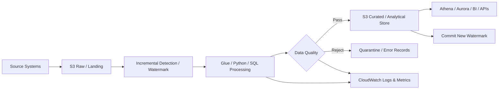

# AWS Incremental Data Pipeline — Production-Inspired Flagship Project

This is a **sanitized production-inspired portfolio project** focused on the architectural transition from expensive recurring full-load processing to an incremental data pipeline on AWS.

It is inspired by a real production problem I worked on, but it does **not** contain proprietary code, internal datasets or confidential employer architecture.

## Why this project is the flagship

The project demonstrates the engineering decisions behind a production case in which a daily full-load pattern was replaced by incremental processing.

In the real environment that inspired this project:
- processing windows were approximately **4–6 hours** before the architectural change;
- the platform supported about **20 production pipelines** and processed millions of records;
- the move to incremental processing produced an observed reduction of approximately **60% in AWS resource consumption**, measured through before/after comparison of processing time, resource usage and cloud cost.

The public implementation below recreates the engineering principles using synthetic data and simplified code.

## Problem

A recurring full load reprocesses historical data even when only a small portion changed.

Typical consequences:
- long-running jobs;
- unnecessary reads, I/O and compute;
- cloud cost that grows with historical volume;
- larger failure blast radius;
- expensive reruns;
- poor scalability as history grows.

## Architecture



### AWS responsibility map

| Responsibility | AWS service / pattern |
| --- | --- |
| Raw and curated storage | Amazon S3 |
| Catalog / metadata | AWS Glue Data Catalog |
| Batch transformation | AWS Glue, Python, SQL |
| Analytical SQL over lake | Amazon Athena |
| Relational serving when appropriate | Amazon Aurora PostgreSQL |
| Scheduling / event triggers | EventBridge / orchestration layer |
| Logs, metrics and alarms | Amazon CloudWatch |
| Credentials | AWS Secrets Manager |
| Access control | AWS IAM |

The exact service selection depends on latency, data volume, workload characteristics and downstream access patterns.

## Incremental strategy

The pipeline processes only records considered new or changed after the previous successful execution.

Potential change indicators include:
- `updated_at` timestamp;
- watermark table;
- CDC sequence/offset;
- monotonically increasing key;
- ingestion timestamp;
- date/partition metadata.

The demo implementation uses `updated_at` because it makes the state transition easy to inspect locally. A production implementation should validate the guarantees of the actual source before selecting this strategy.

## Watermark lifecycle

```text
Read committed watermark
        |
        v
Read candidate changes
        |
        v
Validate + deduplicate
        |
        v
Transform
        |
        v
Merge / upsert target
        |
        v
Reconcile + quality checks
        |
        v
Publish metrics
        |
        v
Commit new watermark
```

The key rule is that the watermark advances **only after the target write and blocking validations succeed**.

## Idempotency

The same logical batch must be safe to execute more than once.

The project demonstrates this through:
- stable record keys;
- latest-record deduplication;
- merge/upsert semantics instead of blind append;
- deterministic replay behavior;
- watermark state separated from transformation logic.

## Late-arriving data

A timestamp-only watermark can miss late records if source timestamps or delivery order are unreliable.

Production options include:
- CDC offsets;
- lookback windows followed by deduplication;
- platform-controlled ingestion timestamps;
- source/target reconciliation;
- explicit late-arrival policies.

This is an important trade-off: incremental processing improves efficiency but introduces state-management complexity.

## Data quality gates

Recommended blocking checks:
- business key not null;
- duplicate-key validation;
- schema/type validation;
- accepted domain values;
- source/target reconciliation;
- freshness within SLA.

Recommended operational metrics:
- rows read;
- rows selected as incremental;
- rows written;
- rejected rows;
- duplicate rows;
- processing duration;
- previous and candidate watermark;
- committed watermark;
- retry count;
- freshness;
- execution status.

## Full load vs incremental

```text
FULL LOAD
Work per execution ≈ complete relevant history

INCREMENTAL
Work per execution ≈ new records + changed records
```

When historical volume grows faster than the daily change rate, the incremental architecture prevents the job from repeatedly paying the cost of unchanged history.

See [`docs/before-after.md`](./docs/before-after.md) for the sanitized production context and metric reasoning.

## Local demo

The project contains a small executable example using only Python's standard library.

### 1. Generate synthetic data

```bash
python projects/aws-incremental-data-pipeline/src/generate_sample_data.py
```

This creates:
- `data/full_snapshot.csv` — synthetic historical state;
- `data/incremental_batch.csv` — a smaller batch of changed records.

### 2. Run the incremental pipeline

```bash
python projects/aws-incremental-data-pipeline/src/incremental_pipeline.py
```

The script:
1. reads a previous watermark;
2. selects only newer rows;
3. deduplicates by key keeping the latest version;
4. performs an idempotent merge;
5. returns execution metrics and the candidate new watermark.

### 3. Run tests

```bash
pytest projects/aws-incremental-data-pipeline/tests -q
```

Tests cover:
- incremental selection;
- deduplication;
- idempotent replay;
- watermark advancement.

## Reprocessing and operations

A resilient pipeline must support reprocessing one logical batch without rebuilding all history.

The operational procedure is documented in:

[`docs/operations-runbook.md`](./docs/operations-runbook.md)

It covers:
- extraction failures;
- transformation failures;
- target-write failures;
- data-quality failures;
- late-arriving data;
- retries;
- reconciliation;
- controlled replay.

## Repository structure

```text
aws-incremental-data-pipeline/
├── README.md
├── architecture.md
├── data/                         # generated synthetic data
├── docs/
│   ├── before-after.md
│   └── operations-runbook.md
├── src/
│   ├── generate_sample_data.py
│   └── incremental_pipeline.py
├── sql/
│   └── incremental_upsert.sql
└── tests/
    └── test_incremental_pipeline.py
```

## Senior-level trade-offs

### Full load may still be better when
- the dataset is small;
- the source has no trustworthy change indicator;
- the job already completes cheaply within SLA;
- simplicity has more value than stateful optimization.

### Incremental becomes attractive when
- historical volume is large;
- daily changes are small relative to history;
- jobs are long-running;
- cloud cost is material;
- SLAs are tighter;
- replayability and failure isolation matter.

### Incremental is not free

It requires explicit decisions about:
- state storage;
- watermark correctness;
- late arrivals;
- updates vs inserts;
- idempotency;
- reconciliation;
- schema evolution;
- recovery procedures.

## Files

- [`architecture.md`](./architecture.md) — architectural decisions and failure scenarios
- [`docs/before-after.md`](./docs/before-after.md) — full-load vs incremental production-inspired comparison
- [`docs/operations-runbook.md`](./docs/operations-runbook.md) — operational recovery and replay strategy
- [`src/generate_sample_data.py`](./src/generate_sample_data.py) — reproducible synthetic dataset
- [`src/incremental_pipeline.py`](./src/incremental_pipeline.py) — executable incremental processing example
- [`tests/test_incremental_pipeline.py`](./tests/test_incremental_pipeline.py) — tests for selection, deduplication, idempotency and watermark behavior
- [`sql/incremental_upsert.sql`](./sql/incremental_upsert.sql) — SQL merge/upsert reference

## What this project demonstrates

This project is designed to demonstrate Senior Data Engineering reasoning around:

`AWS` · `incremental processing` · `watermarks` · `idempotency` · `partitioning` · `data quality` · `observability` · `reprocessing` · `performance` · `cloud cost` · `failure recovery` · `trade-offs`
